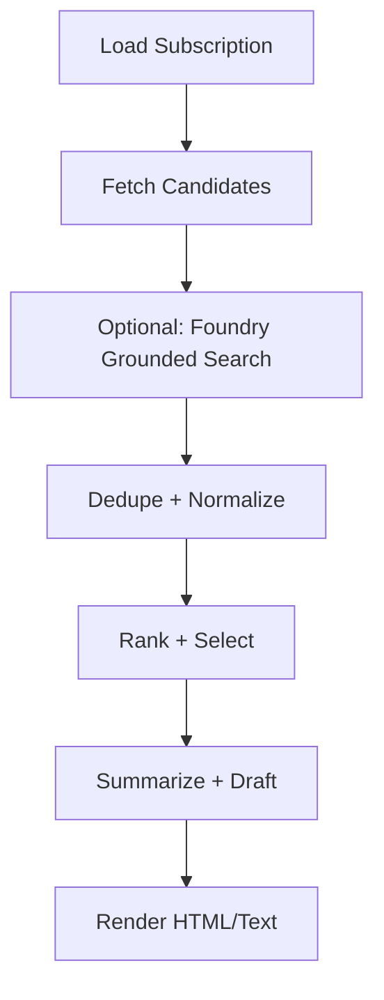

# Architecture (MVP)

## Components
- **Web app (Next.js)**: settings + history UI
- **API (FastAPI)**: CRUD for users/subscriptions, run orchestration
- **Agent package (LangChain + LangGraph)**: gather → dedupe → rank → write newsletter
- **Scheduler (Azure Functions Timer Trigger)**: calls `POST /runs/send-due` on a schedule
- **Storage (Cosmos DB)**: user + subscription + run history
- **Email provider**: Azure Communication Services Email (recommended) or SendGrid

## Why Grounding with Bing Search (Foundry) instead of Bing Search APIs?
Bing Search APIs were retired on **Aug 11, 2025**; Microsoft recommends migrating to **Grounding with Bing Search** in Azure AI Agents.

## Data model
- User: `{ id, email, created_at }`
- Subscription: `{ id, user_id, topics[], sources[], frequency, item_count, tone, enabled }`
- NewsletterRun: `{ id, subscription_id, run_at, status, items[], html, text, error? }`

## Graph (LangGraph)

